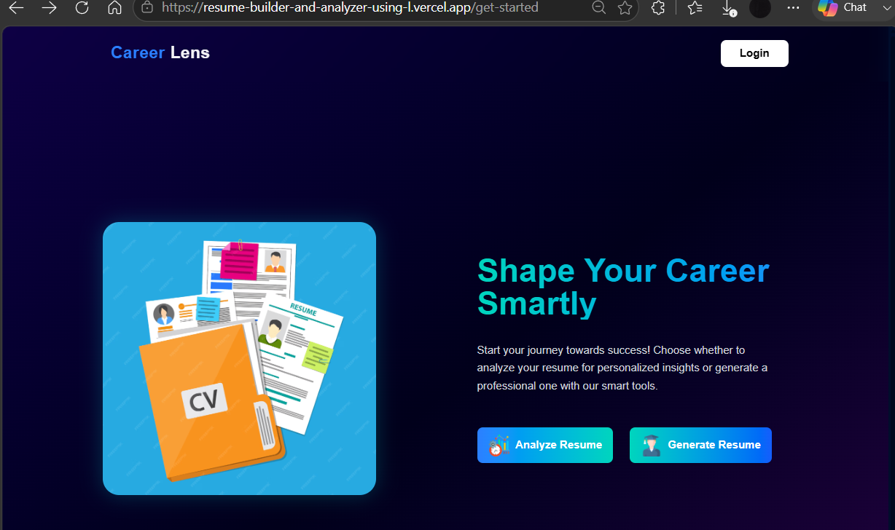
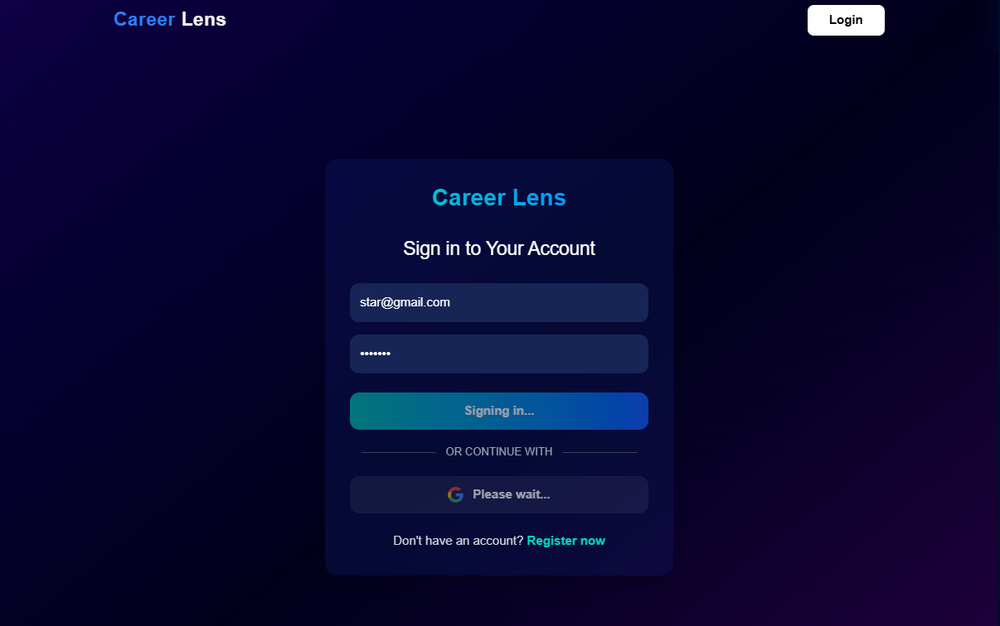

### Resume Builder and Analyzer Using LLM

# 🚀 Career Lens – AI-Powered Resume Builder & Analyzer

Career Lens is a full-stack AI-powered web application that enables users to create professional resumes and receive intelligent resume analysis using Large Language Models (LLMs). The platform helps users optimize their resumes for Applicant Tracking Systems (ATS) by providing AI-generated feedback, improvement suggestions, and resume scoring.

---

## 📌 Features

- 📝 Build professional resumes using customizable templates
- 🤖 AI-powered resume analysis using Google's Gemini LLM
- 📊 ATS-friendly resume evaluation
- 🎯 Resume scoring and improvement suggestions
- 📄 Download resumes in PDF format
- 🔐 User authentication
- ☁️ Cloud image storage using Cloudinary
- 🔥 Firebase integration
- 🌐 Responsive and modern user interface

---

## 🛠️ Tech Stack

### Frontend
- React.js
- TypeScript
- Tailwind CSS
- Vite

### Backend
- Node.js
- Express.js
- TypeScript

### Database
- MongoDB Atlas

### AI Integration
- Google Gemini API

### Authentication & Cloud Services
- Firebase Authentication
- Cloudinary

### Version Control
- Git
- GitHub

---

## 📂 Project Structure

```
Career-Lens/
│
├── backend-nodejs/
│   ├── src/
│   ├── dist/
│   ├── package.json
│   └── ...
│
├── resume-builder-and-analyzer-using-llm/
│   ├── src/
│   ├── public/
│   ├── package.json
│   └── ...
│
├── README.md
└── .gitignore
```

---

## ⚙️ Installation

### Clone the repository

```bash
git clone https://github.com/your-username/Career-Lens.git
```

### Backend Setup

```bash
cd backend-nodejs
npm install
npm run dev
```

### Frontend Setup

```bash
cd resume-builder-and-analyzer-using-llm
npm install
npm run dev
```

---

## 🔑 Environment Variables

Create a `.env` file and configure the following variables:

```env
MONGODB_URI=your_mongodb_connection_string
GEMINI_API_KEY=your_gemini_api_key

FIREBASE_API_KEY=your_key
FIREBASE_AUTH_DOMAIN=your_domain
FIREBASE_PROJECT_ID=your_project_id
FIREBASE_STORAGE_BUCKET=your_bucket
FIREBASE_MESSAGING_SENDER_ID=your_sender_id
FIREBASE_APP_ID=your_app_id

CLOUDINARY_CLOUD_NAME=your_cloud_name
CLOUDINARY_UPLOAD_PRESET=your_upload_preset
```

> **Note:** Never commit API keys or credentials to GitHub. Use environment variables instead.

---

# 📸 Application Preview

## 🏠 Home Page



---

## 🔐 Login



---

## 📑 Template Selection


---

## ✍️ Resume Generation Process


---

## 🤖 Missing Skills Analysis


---

## 📊 ATS Score


---

## 📄 Generated Resume


---

## 📈 Future Enhancements

- Multi-language resume support
- Cover letter generation
- Job description matching
- Resume keyword optimization
- Interview preparation module
- Admin dashboard
- Resume version history

---

## 🤝 Contributing

Contributions are welcome!

1. Fork the repository
2. Create a feature branch
3. Commit your changes
4. Push the branch
5. Open a Pull Request

---

## 👨‍💻 Author

**Jayesh Tupere**

- LinkedIn: *(https://www.linkedin.com/in/jayesh-tupere/)*
- GitHub: https://github.com/itz-jayesh

---

## 📄 License

This project is intended for educational and portfolio purposes.
